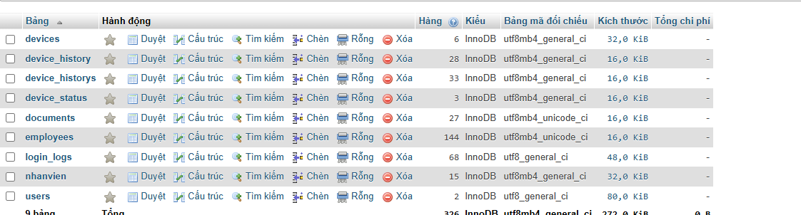

// Mở preview Ctrl + Shift + V
# Ghi chú tài liệu

## 1. Cập nhật tài liệu lên github

[Working Directory] --(git add)--> [Staging Area] --(git commit)--> [Local Repo] --(git push)--> [GitHub]
                                                                        ^                           |
                                                                        +-------(git pull)----------+
- Thiết lập git
  $ git config --global user.name "trongtuan141099"
  $ git config --global user.email trongtuan141099@gmail.com

- Khởi tạo kho chứa Git ẩn (.git):
  $ git init
  $ git remote add origin https://github.com/trongtuan141099/myweb.git

- Kiểm tra liên kết:
  $ git remote -v

- Upload code lên githut

  Xem trạng thái các file bị thay đổi/mới tạo:
  $ git status

  Đưa toàn bộ file thay đổi vào Staging Area (Sảnh chờ):
  $ git add . (hoặc git add <tên_file> để chọn từng file)

  Lưu lại điểm khôi phục vào Local Repo kèm mô tả:
  $ git commit -m "Khởi tạo dự án và thêm file cơ bản"

  Đẩy nhánh main lên GitHub (Lần đầu tiên dùng cờ -u để ghi nhớ nhánh):
  $ git push origin master

  Các lần push sau chỉ cần gõ:
  $ git push

### Lấy code về máy mới & Đồng bộ hàng ngày:Sử dụng trên máy tính thứ 2.
  Lần đầu trên Máy B: Tải toàn bộ kho chứa về:
  git clone <URL_REPOSITORY_CUA_BAN>
  
  Luôn kéo code mới nhất từ GitHub về trước khi sửa code:
  git pull

API (Application Programming Interface)
AJAX (Asynchronous JavaScript and XML)

CÁCH SỬA LỖI MYSQL "SHUTDOWN UNEXPECTEDLY" TRÊN XAMPP

Lưu ý: Cách làm này giúp khôi phục dữ liệu an toàn mà không làm mất các database do bạn tạo.

# Bước 1: Mở thư mục cài đặt XAMPP

    Truy cập vào thư mục XAMPP trên máy tính (đường dẫn mặc định thường là C:\xampp\).

    Thấy thư mục mysql bên trong.

# Bước 2: Đổi tên thư mục data cũ

    Đổi tên thư mục C:\xampp\mysql\data thành C:\xampp\mysql\data_old.

# Bước 3: Tạo thư mục data mới từ thư mục backup

    Tạo một thư mục mới đặt tên là data tại đường dẫn C:\xampp\mysql\.

    Truy cập vào thư mục C:\xampp\mysql\backup.

    Copy (Sao chép) toàn bộ thư mục/file bên trong backup và dán vào thư mục data vừa tạo.

# Bước 4: Khôi phục cơ sở dữ liệu cá nhân

    Truy cập lại vào thư mục C:\xampp\mysql\data_old.

    Copy tất cả các thư mục tên database do bạn tạo (Lưu ý: KHÔNG copy các thư mục hệ thống như mysql, performance_schema, phpmyadmin, test).

    Dán các thư mục database vừa copy vào thư mục C:\xampp\mysql\data.

    Copy thêm tệp ibdata1 từ data_old và dán đè vào C:\xampp\mysql\data (Lưu ý: KHÔNG copy các tệp ib_logfile*).

# Bước 5: Khởi động lại MySQL

    Mở XAMPP Control Panel và nhấn nút Start ở dòng MySQL.

    Bấm nút Admin ở dòng MySQL để truy cập lại phpMyAdmin.